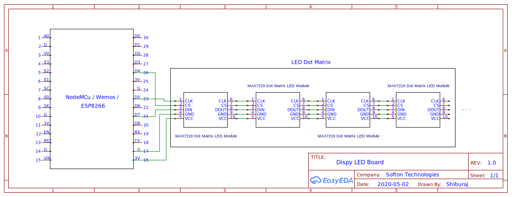

# Dispy LED Dot Matrix Board
### [Dispy Website (https://dispy.in)](www.dispy.in)

This schematic can be used by anyone to create a smart led dot matrix scrolling display board with few simple steps. 

## Steps to Create your Own LED Display

1. Visit https://dispy.in and create an account.
2. Login with your account.
3. Create a new device.
4. Create as much slides as needed that will be shown on this device.\
5. Add your slides to your device by going to the Manage Slides page.
6. Note down the Device ID in the Manage Slides page. Every device has a unique id.
7. Now Clone this Repo to your desktop using git or Download the source.
8. Copy the config.h.sample to config.h
9. Open the Smart_Notice_Board.ino file in Arduino IDE.
9. Edit the File with appropriate details. Device ID is the most important here. First Four lines of the config file is also must.
10. connect your ESP8266/Nodemcu/Wemos/etc. Module and program this code.
11. OTA is enabled so after the first program wireless programming can be done.
12. Hurray! All Done. Your device will start showing the messages once it connects to the internet.

## Schematic Diagram


## Connections
```
//################# DISPLAY CONNECTIONS ################
// LED Matrix Pin -> ESP8266 Pin
// Vcc            -> 3v  (3V on NodeMCU 3V3 on WEMOS)
// Gnd            -> Gnd (G on NodeMCU)
// DIN            -> D7  (Same Pin for WEMOS)
// CS             -> D4  (Same Pin for WEMOS)
// CLK            -> D5  (Same Pin for WEMOS)
```